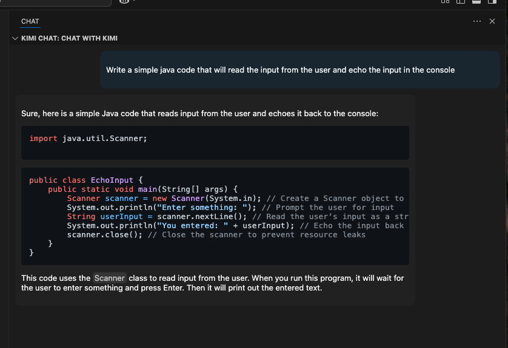

# KimiChat README

KimiChat is a Visual Studio Code extension that allows you to interact with the Kimi API directly from your editor. Use it to ask questions, get code suggestions, or chat with Kimi in a dedicated panel.

---

## Features

- **Chat Interface**: A dedicated panel on the right side of the editor for chatting with Kimi.
- **Markdown Rendering**: Responses are rendered with full Markdown support, including syntax-highlighted code blocks.
- **Customizable API Settings**: Configure your API key and API URL directly from the extension settings.
- **Error Handling**: Displays error messages when the API key is missing or when requests fail.

---

## Requirements

- A valid API key from [Kimi Platform](https://platform.moonshot.cn/).
- Internet access to communicate with the Kimi API.

---

## Extension Settings

This extension contributes the following settings:

- `kimiChat.apiKey`: The API key for authenticating with the Kimi API. You can obtain your API key from [Kimi Platform](https://platform.moonshot.cn/).
- `kimiChat.apiUrl`: The API URL for Kimi Chat. The default value is `https://api.moonshot.cn/v1/chat/completions`.

---

## How to Use

1. Install the extension in Visual Studio Code.
2. Open the **Command Palette** (`Cmd+Shift+P` on macOS or `Ctrl+Shift+P` on Windows/Linux).
3. Search for `Preferences: Open Settings (UI)` and configure the following:
   - `kimiChat.apiKey`: Enter your API key.
   - `kimiChat.apiUrl`: (Optional) Update the API URL if needed.
4. Open the **Kimi Chat** panel from the right-side panel in VS Code.
5. Start chatting with Kimi by typing your prompt and clicking the "Send" button.

---

## Known Issues

- **Missing API Key**: If the API key is not configured, the extension will display an error message.
- **Network Errors**: Ensure you have a stable internet connection to communicate with the Kimi API.

---

## Release Notes

### 1.0.0

- Initial release of KimiChat.
- Added support for Markdown rendering and syntax-highlighted code blocks.
- Customizable API key and URL settings.

---

## Following Extension Guidelines

Ensure that you've read through the extension guidelines and follow the best practices for creating your extension.

- [Extension Guidelines](https://code.visualstudio.com/api/references/extension-guidelines)

---

## For More Information

- [Visual Studio Code's Markdown Support](http://code.visualstudio.com/docs/languages/markdown)
- [Markdown Syntax Reference](https://help.github.com/articles/markdown-basics/)

**Enjoy chatting with Kimi!**
